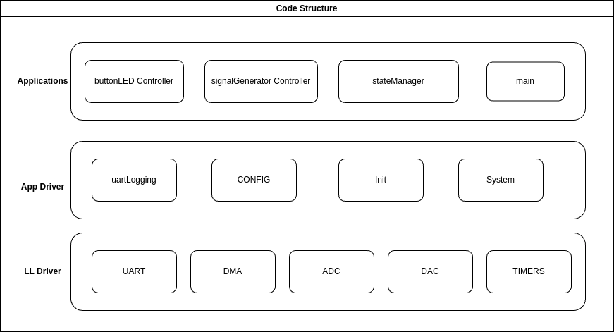
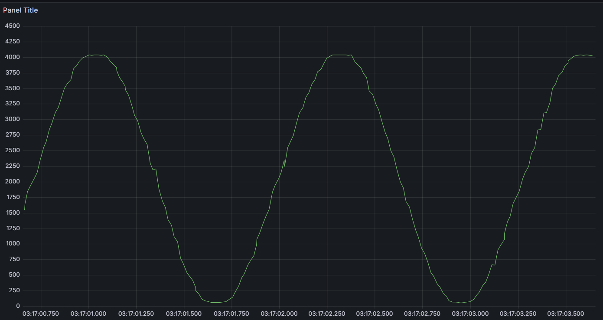
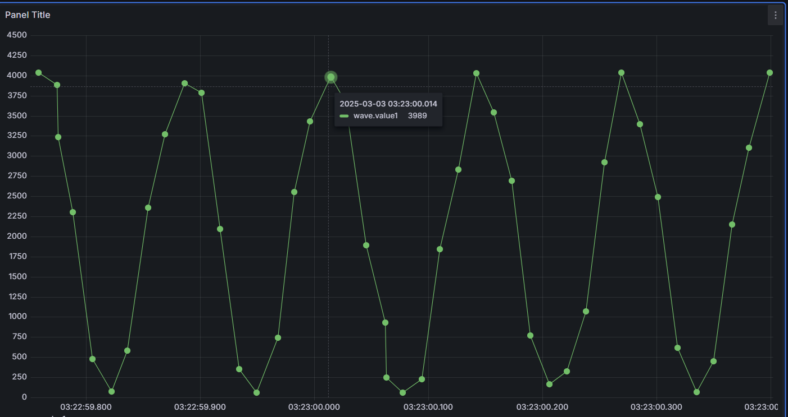
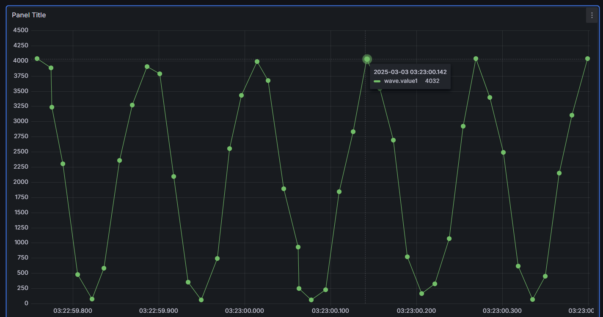

# Project Description

- The microcontroller generates the Sine wave from frequency 0.78 Hz to 7.8125 Hz with the step size of 0.78125 Hz using the button press.

- By default on startup Microcontroller generates Sine Wave of 0.78 Hz and when the Button is pressed the frequency of the sine wave is increased by 0.78125 Hz. 

- After 7.8125 Hz when the button is pressed the frquency is rolled over to the starting frequency which is 0.78125 Hz.

- The ADC data is sampled at 100 Hz and the data is sent over the UART to the Host.

# Code Structure

# Results
- Below are the ADC Raw Data graphs.

- The Sine Wave with Frequency of 0.78Hz

- The Sine wave with Frequency of 7.8125 Hz